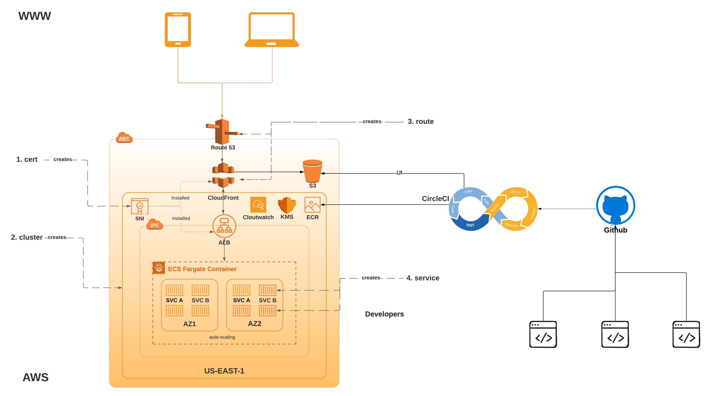

# Motivation
My wife runs a small family veterinary practice in a beautiful town of Mill Valley, California called **[Camino ALto Veterinary Hospital](https://caminoaltovet.com/)**. 
Six 6 years ago when she acquired the practice, I helped her build the website along with some of the cool features which are completely unique to her website like "Ask your doctor". 
Many a times, in the night/ weekend, she has gotten a message through it and has replied to provide quality care for her pet family. 
When I intially designed her webiste, I made  sure it was 100% responsive, loads fast in every device, contain all the important informations
like making "Online Appointments", seeking "Directions", looking for "Promotions", right on the face. Above all it was very intuitve and built entirely serverless.

And then Covid19 happened. World suddenly got more virtual. She right away felt the need for more automation, personalization and next generation website that could help
small business like her to thrive.

I will be using this repo to blog about the architecture & the philosophy on how I am going to build the new site for her. 

# Philosophy
Since I am a big fan of simplicity & automation, I am going to pick tools/ technologies to build architecture & frameworks, 
which will help me  automate the build, deployment and testing process while keeping the cost as low as possible. 

Even though the architecture and framework will be opinionated, I will try to make it as generic as possible and replacing
one tech with other should not make any difference.

# Architecture

- API 1st (contract based development). All state management happens through API, no exceptions. Open API 3.0 for defining contracts.
- Micro service development pattern. Each service will have it's own API (yaml) file. Deployment may still be uniform (all API together).
- CI/ CD (continious integration and deployment). Trunk is always deployed automatically (once the test passes).
- TDD (Test driven development). Every piece of code comes with a test.
- UI will be a mix of SFA (single page app) and static (better SEO). ALways deployed serveless (via CDN).